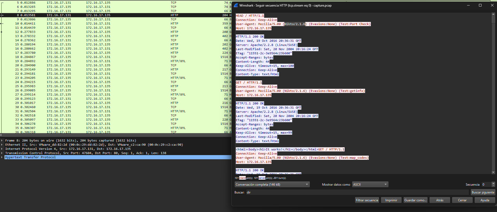

# Baby's First Forensics
### 100
beginner
They've been trying to breach our infrastructure all morning! They're trying to get more info on our covert kangaroos! We need your help, we've captured some traffic of them attacking us, can you tell us what tool they were using and its version?

NOTE: Wrap your answer in the DUCTF{}, e.g. DUCTF{nmap_7.25}

Author: Pix

[File]()

# Solution

In this challenge, HTTP requests are validated, and the tool Nikto is found.

  

### Flag: DUCTF{Nikto_2.1.6}
