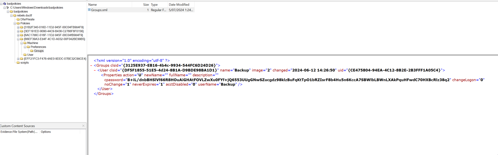
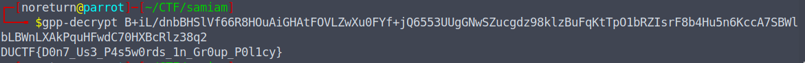

# Bad Policies
### 136
beginner

Looks like the attacker managed to access the rebels Domain Controller.

Can you figure out how they got access after pulling these artifacts from one of our Outpost machines?

Author: TurboPenguin

[File](../Forensic/files/badpolicies.zip)

# Solution:

In the challenge, we were informed about possible domain controllers. To get a better view, I opened the file with AccessData FTK Imager. While searching through the files, I found a file named Groups.xml, where I discovered the string:

  

`cpassword="B+iL/dnbBHSlVf66R8HOuAiGHAtFOVLZwXu0FYf+jQ6553UUgGNwSZucgdz98klzBuFqKtTpO1bRZIsrF8b4Hu5n6KccA7SBWlbLBWnLXAkPquHFwdC70HXBcRlz38q2" changeLogon="0"`

Upon researching this, I learned that it was encrypted with Group Policy Preferences (GPP) and is very insecure to decrypt.

To decrypt it, I used a tool called gpp-decrypt and obtained the flag:

  

### Flag: DUCTF{D0n7_Us3_P4s5w0rds_1n_Gr0up_P0l1cy}
