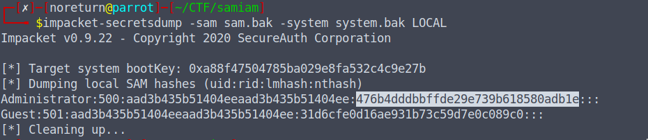
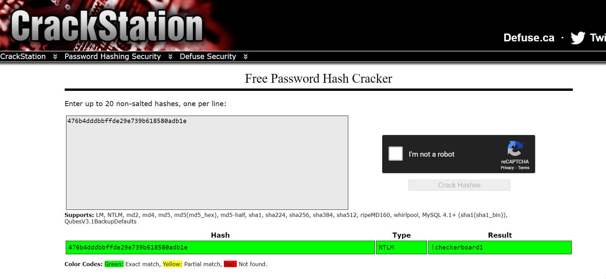

# SAM I AM
### 119
The attacker managed to gain Domain Admin on our rebels Domain Controller! Looks like they managed to log on with an account using WMI and dumped some files.

Can you reproduce how they got the Administrator's Password with the artifacts provided?

Place the Administrator Account's Password in DUCTF{}, e.g. DUCTF{password123!}

Author: TurboPenguin

[File](../forensic/files/samiam.zip)

# Solution

SAM (Security Account Manager) is a database file that stores users’ passwords, which can be used to authenticate local and remote users. 

Using impacket-secretdump, the credentials were found as follows:

  

Then, with CrackStation, the hash was reversed.

  

### Flag: DUCTF{!checkerboard1}
