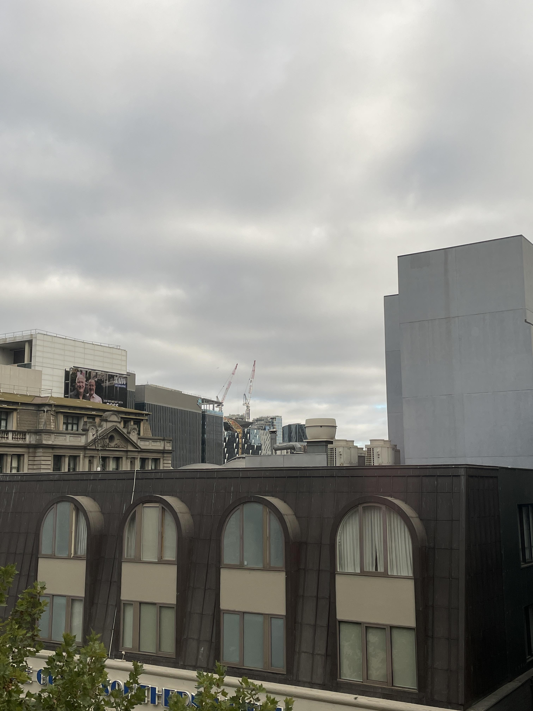
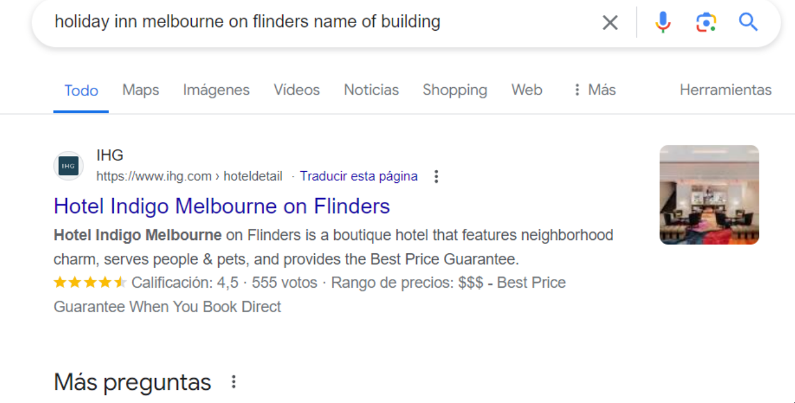

# cityviews
### 100
easy

After having to go on the run, I've had to bunker down. Which building did I capture this picture from?

NOTE: Flag is case-insensitive and requires placing inside DUCTF{}! e.g DUCTF{building_name}

Author: Anon

  

# Solution

Find where the program '3AW Breakfast with Ross and Russ' is located, and then find the location of `Media House, Level 7, 655 Collins Street, Docklands, VIC 3008, Melbourne, Australia`.

After that, it was easy to find the hotel. It just had an outdated name, so I had to do a simple search on Google

  

### Flag: DUCTF{Hotel_Indigo_Melbourne}
