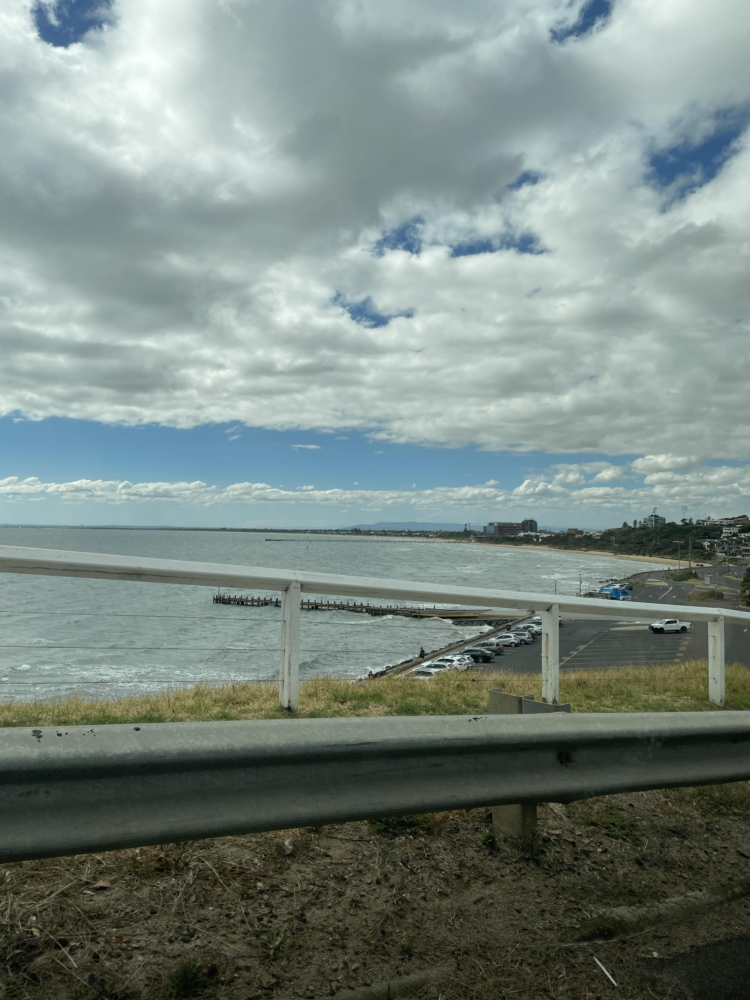
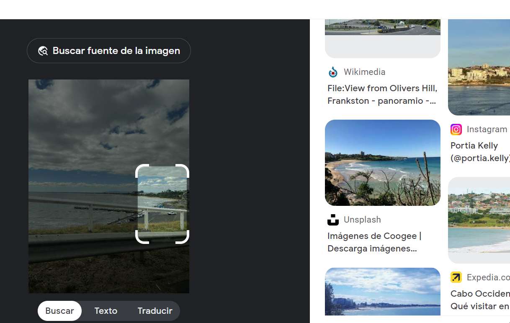
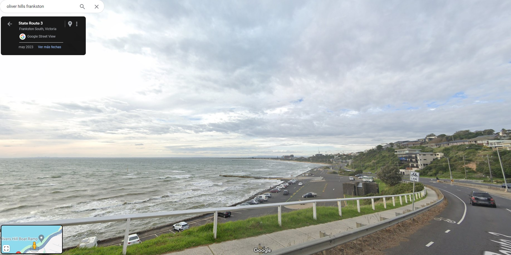

# offtheramp
### 100
beginner

That looks like a pretty cool place to escape by boat, EXAMINE the image and discover the name of this structure.

NOTE: Flag is case-insensitive and requires placing inside DUCTF{}! e.g DUCTF{name_of_structure}

Author: Anon

  

# Solution

Using some reverse image techniques, I was able to obtain the address from that image, which was easy to locate using maps.

  
  

### Flag: DUCTF{olivers_hill_boat_ramp}
