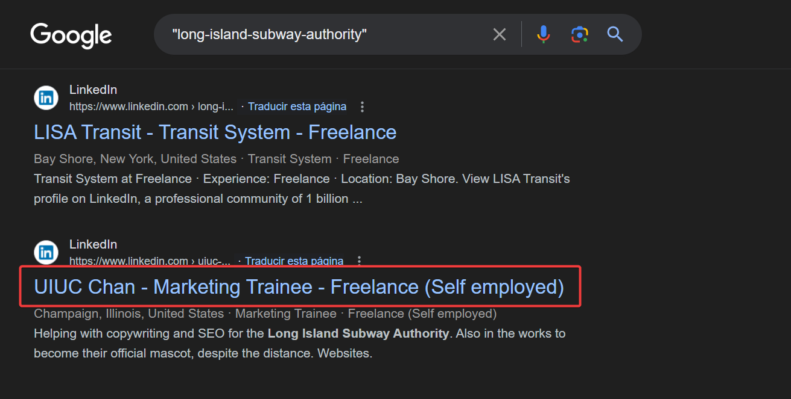
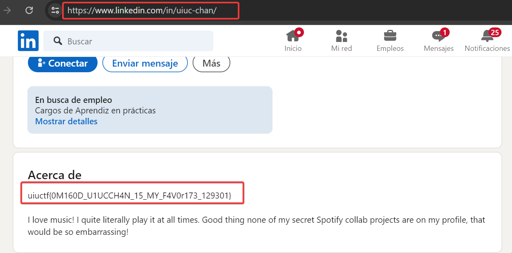

# An Unlikely Partnership

It appears that the Long Island Subway Authority (LISA) has made a strategic business partnership with a surprise influencer! See if you can figure out who.

This is part two of a three-part OSINT suite including Hip With the Youth, An Unlikely Partnership, and The Weakest Link. This challenge is possible without Hip With the Youth but will be easier if you start there.

# Solution

To find the profiles, use a search engine with the dork `long-island-subway-authority`, which leads to the LinkedIn profile: [long-island-subway-authority](https://www.linkedin.com/in/long-island-subway-authority). 

  

This profile appears to belong to a possible SEO user of the company. In the `About` section of this LinkedIn profile. 

  

### uiuctf{0M160D_U1UCCH4N_15_MY_F4V0r173_129301}.
