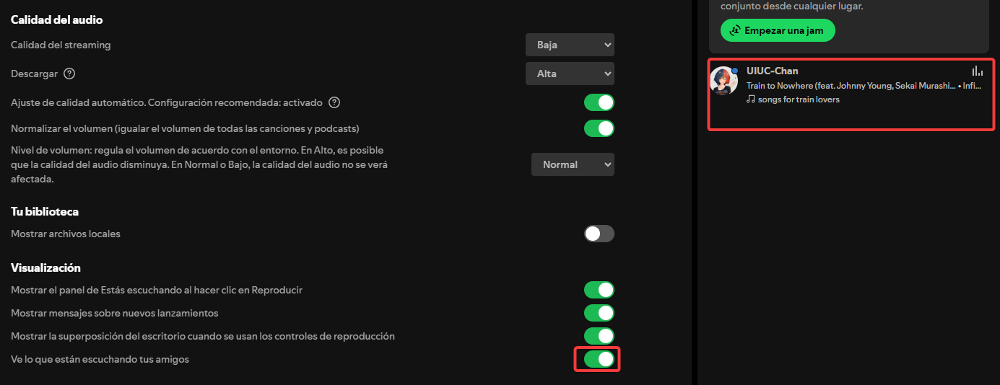
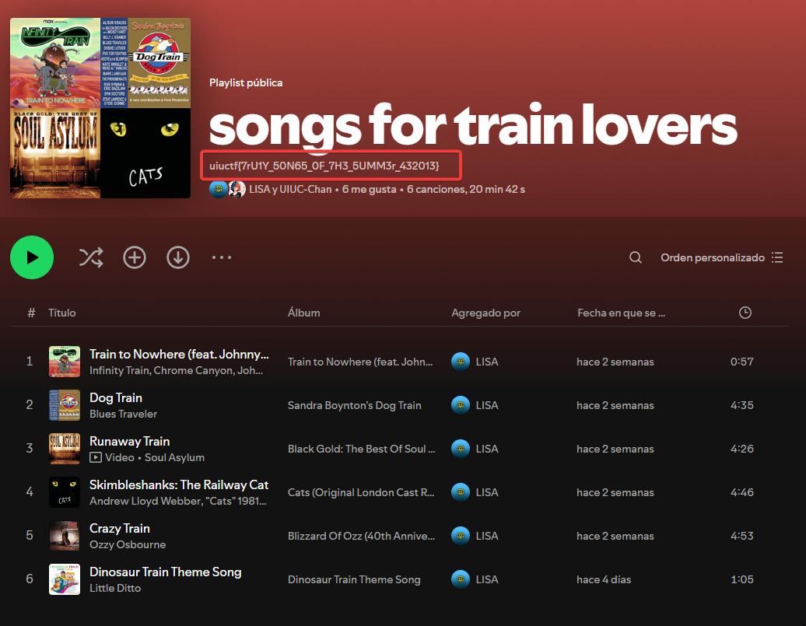

# The Weakest Link

LISA and the secret business partner have a secret Spotify collaboration planned together. Unfortunately, neither of them have the opsec to keep it private. See if you can figure out what it is!

This is part three of a three-part OSINT suite including Hip With the Youth, An Unlikely Partnership, and The Weakest Link. I recommend starting with the other two challenges!

# Solution

1. To solve this challenge, first we must find the target's Spotify account: [Spotify](https://open.spotify.com/user/31d2lcivqdieyl4qzx25vfmp6jt4?si=b769b2466f7e4101).

After that, I tried searching many times on his followers, on links, with dorks and more, but I couldn't manage to find anything relevant.

Exploring different Spotify settings, I realized that I could activate the `See what your friends are listening to` option. Once enabled, I could see on the right side of the user interface, a recent activity by user `UIUC-Chan` that included a playlist called "Songs for train lovers".

  

Upon entering that playlist, I found the flag in the playlist description.

  

### uiuctf{7rU1Y_50N65_0F_7H3_5UMM3r_432013}
