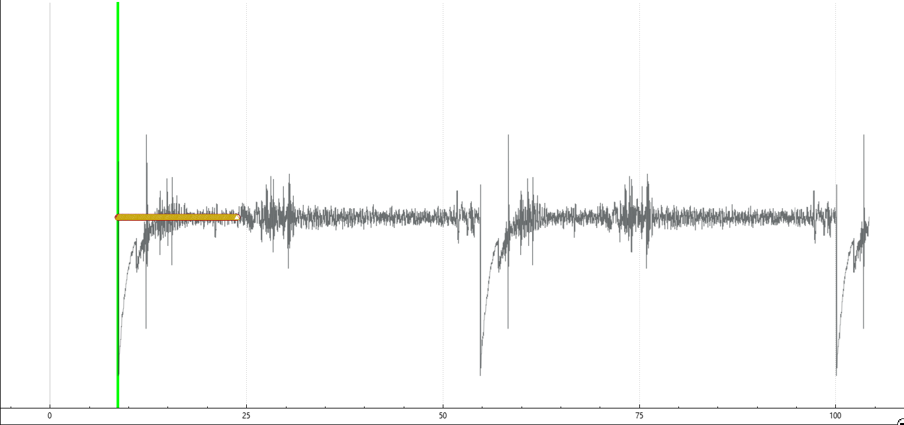
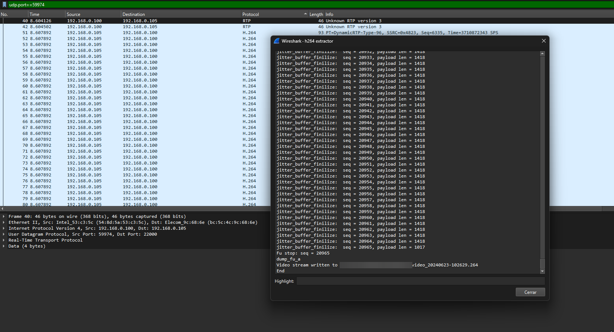
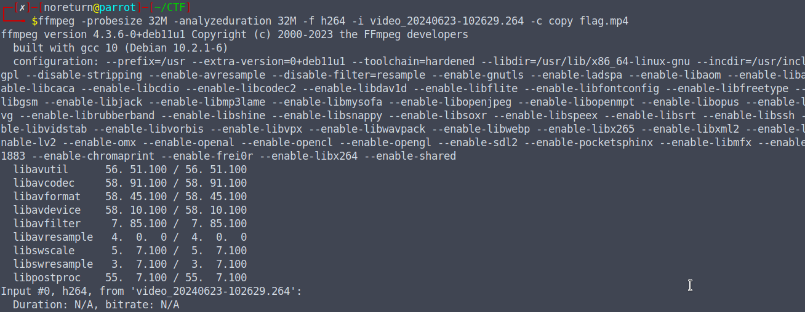
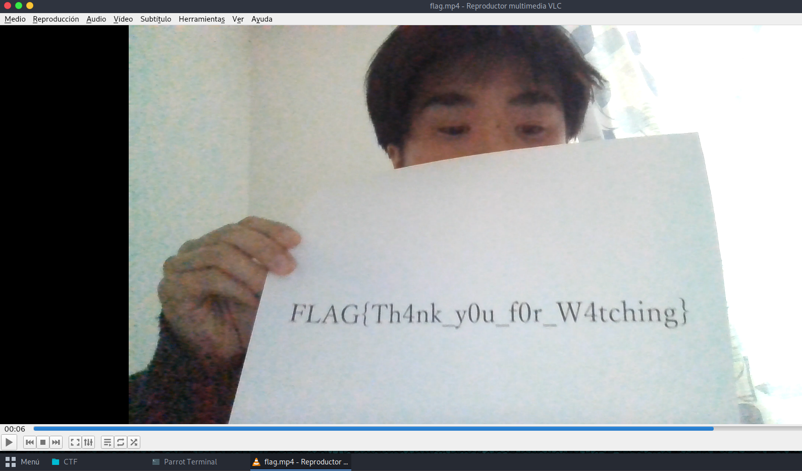

# I_wanna_be_a_streamer
### 169pt Easy

Sorry Mom, I'll work as a streamer.
Watch my stream once in a while.
(H.264 is used for video encoding.)

[Archivo](../files/for-I-wanna-be-a-streamer.zip)

# Solución

1. Al visualizar el archivo PCAP con Wireshark, se identificó el protocolo RTP, que contenía una pista de audio que probablemente formaba parte de un stream de video.

  

2. Se logró identificar que esta codificado en algo llamado `video H.264`.

3. Luego de realizar una busqueda de Osint, logré encontrar un repositorio en GitHub [h264extractor](https://github.com/volvet/h264extractor), que contenía un plugin para usar en Wireshark para extraer estos paquetes H.264 para formar un archivo de transmisión de video completo.

   Luego de pelear un gran rato con la instalación, logré instalarlo y usarlo...

  

4. Después de extraer el video con la extensión .264, utilicé el comando ffmpeg -probesize 32M -analyzeduration 32M -f h264 -i video_20240623-102629.264 -c copy flag.mp4 para realizar la encapsulación del stream de video H.264 en un contenedor MP4 sin alterar la codificación original.

  

5. Se obtuvo el video en formato `MP4` y así se consiguió la bandera.

  

### FLAG{Th4nk_y0u_f0r_W4cthing}
