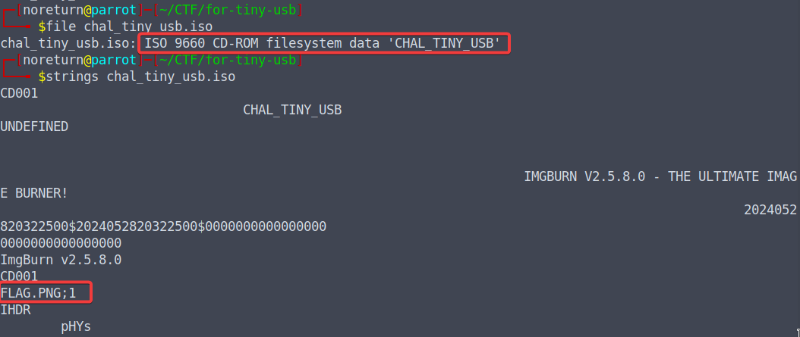
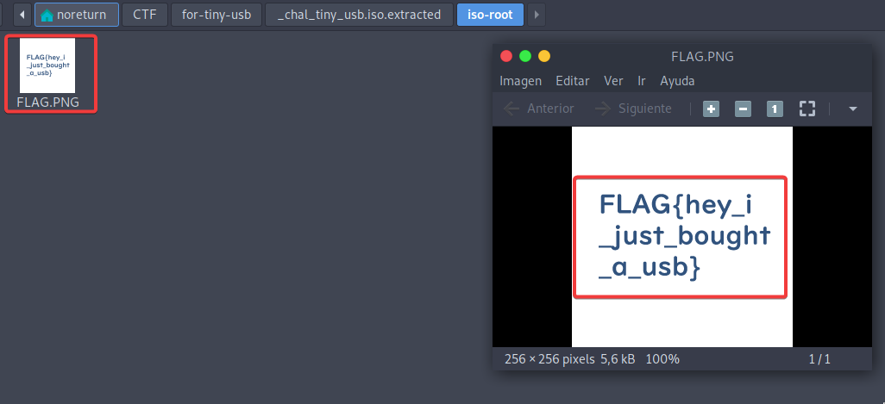

# tiny_usb
### 125pt Beginner

USBが狭い
What a small usb!

[Archivo](../files/for-tiny-usb.zip)

## Solución 

Nos dan un archivo .iso (chal_tiny_usb.iso), que es posiblemente un volcado de la memoria USB en el que se podrá encontrar la bandera.

1. Confirmar que tipo de archivo es.
2. Revisar con strings para buscar información que nos pueda ser util.

  

3. Identificar que hay una posible imagen añadida en la iso.
4. Utilizar el comando "Binwalk" para extraer datos del archivo.
5. Encontramos una imagen que contiene la flag: FLAG{hey_i_just_bought_a_usb}

  

