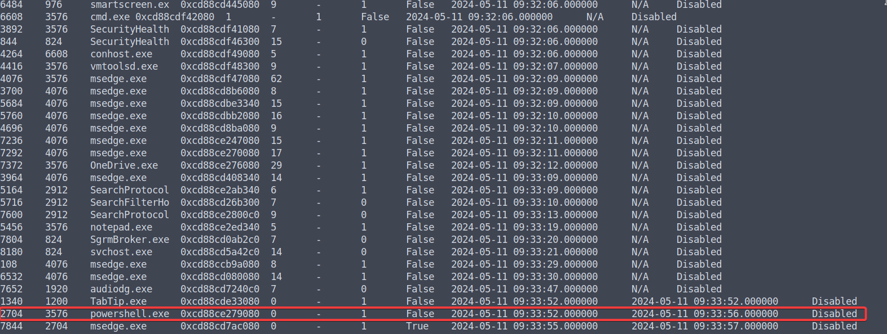
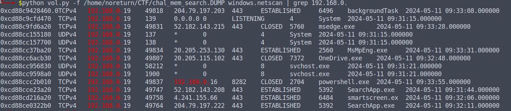
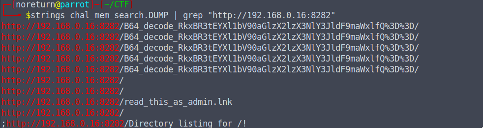
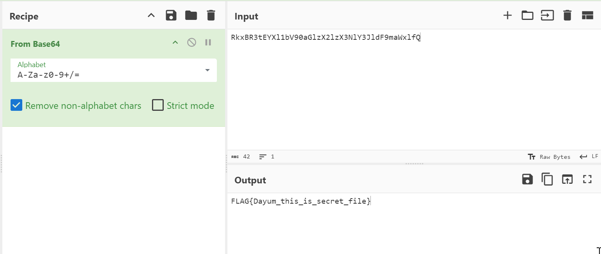

# mem_search
### 211pt Hard

I found an unknown file, and upon opening it, it caused some strange behavior, so I took a memory dump!

How was the attack carried out?

The memory dump is large, and you can download it from the following URL (it will be 2GB when extracted).

Please note that the file may become unavailable after the WaniCTF event.

[Link Descarga](https://drive.google.com/file/d/1sxnYz-bp-E9Bj9usN8lRoL4OE8AxrCRu/view?usp=sharing)

# Solución

1. Primero revisamos el archivo con volatility (personalmente uso las versiones 2 y 3).

2. Ejecutamos diferentes comandos para encontrar procesos y lograr entender que sucede:
```
python vol.py -f /home/noreturn/CTF/chal_mem_search.DUMP windows.pslist
python vol.py -f /home/noreturn/CTF/chal_mem_search.DUMP windows.pstree
python vol.py -f /home/noreturn/CTF/chal_mem_search.DUMP windows.filescan
```
Y otros comandos mas.

3. Se identificó que hay un proceso de `powershell.exe` que por lo general ejecutan algunos comandos, cuando hay algún Comand and control (C2).
<p align="center">
  
</p>

4. Se buscó información sobre ese proceso, usando cmdline, dumpfile y otros, pero no se logró obtener ningúna respuesta.

5. Utilizando Volatility y el comando `python vol.py -f /home/noreturn/CTF/chal_mem_search.DUMP windows.netscan`, se identificó conexiones de red relacionadas con el proceso powershell.exe. Este proceso tenía una conexión local cerrada en la dirección IP 192.168.0.16 en el puerto 8282. Tal actividad en powershell.exe puede ser normal o sospechosa dependiendo del contexto, ya que este proceso puede ejecutar scripts que interactúan con sistemas locales o remotos.

<p align="center">
  
</p>

6. Luego de encontrar esa posible dirección IP, utilizamos `strings chal_mem_search.DUMP | grep "http://192.168.0.16:8282"` y se encontró:

- `http://192.168.0.16:8282/B64_decode_RkxBR3tEYXl1bV90aGlzX2lzX3NlY3JldF9maWxlfQ%3D%3D/`
   
<p align="center">
  
</p>

7. Decodificamos con base64 el path `hRkxBR3tEYXl1bV90aGlzX2lzX3NlY3JldF9maWxlfQ` y obtenemos la Flag.

<p align="center">
  
</p>

## FLAG{Dayum_this_is_secret_file}
