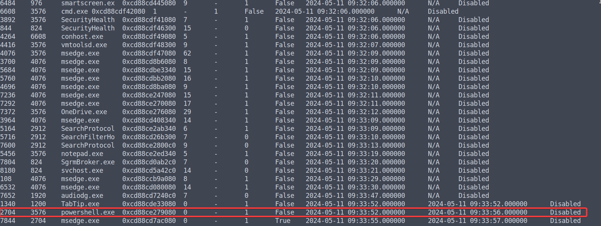
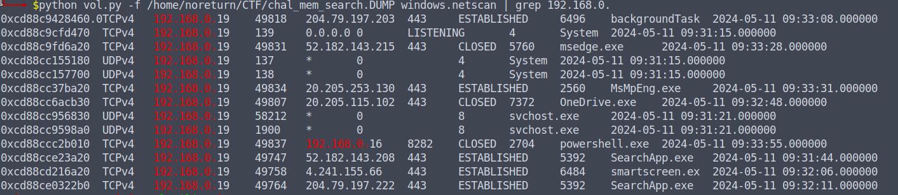
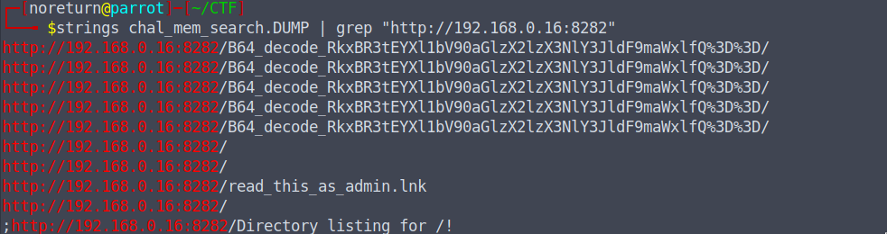
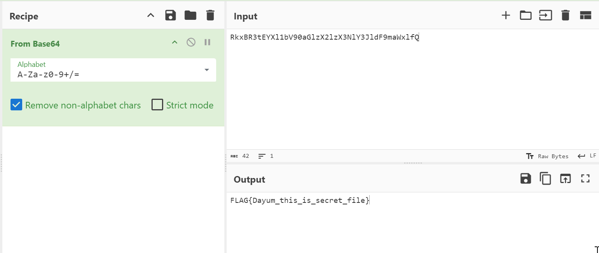

# mem_search
### 211pt Hard

I found an unknown file, and upon opening it, it caused some strange behavior, so I took a memory dump!

How was the attack carried out?

The memory dump is large, and you can download it from the following URL (it will be 2GB when extracted).

Please note that the file may become unavailable after the WaniCTF event.

[Link](https://drive.google.com/file/d/1sxnYz-bp-E9Bj9usN8lRoL4OE8AxrCRu/view?usp=sharing)

# Solution

1. First, I reviewed the file with Volatility (I personally use versions 2 and 3).

2. I executed various commands to find processes and try to understand what was happening:

```
python vol.py -f /home/noreturn/CTF/chal_mem_search.DUMP windows.pslist
python vol.py -f /home/noreturn/CTF/chal_mem_search.DUMP windows.pstree
python vol.py -f /home/noreturn/CTF/chal_mem_search.DUMP windows.filescan
```

And many other commands.

3. It was identified that there is a `powershell.exe` process, which often executes some commands when there is some Command and Control (C2) activity.
<p align="center">

</p>

4. Information about this process was sought using cmdline, dumpfile, and others, but no conclusive information was obtained.

5. Using Volatility and the command `python vol.py -f /home/noreturn/CTF/chal_mem_search.DUMP windows.netscan`, network connections related to the powershell.exe process were identified. This process had a closed local connection at IP address 192.168.0.16 on port 8282. Such activity in powershell.exe can be normal or suspicious depending on the context, as this process can run scripts that interact with local or remote systems.

<p align="center">

</p>

6. After finding that possible IP address, we used `strings chal_mem_search.DUMP | grep "http://192.168.0.16:8282"` and found:

- `http://192.168.0.16:8282/B64_decode_RkxBR3tEYXl1bV90aGlzX2lzX3NlY3JldF9maWxlfQ%3D%3D/`

<p align="center">

</p>

7. We decoded the Base64 path `hRkxBR3tEYXl1bV90aGlzX2lzX3NlY3JldF9maWxlfQ` and obtained the Flag.

<p align="center">

</p>

## FLAG{Dayum_this_is_secret_file}


