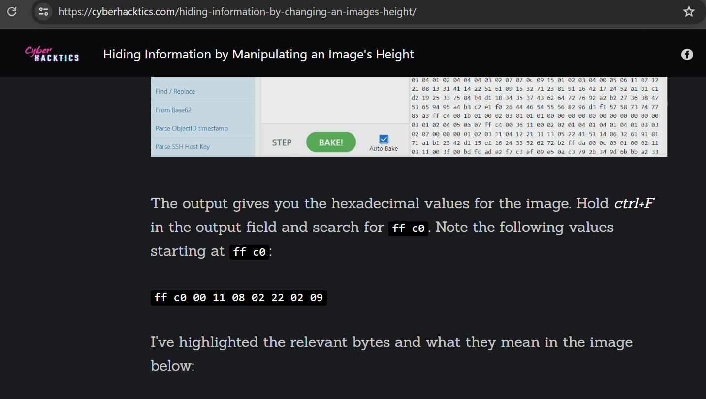
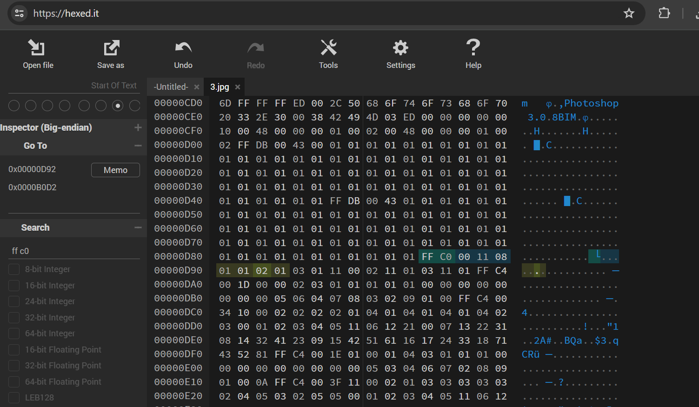
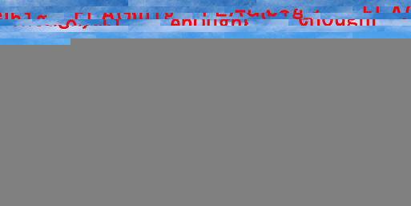
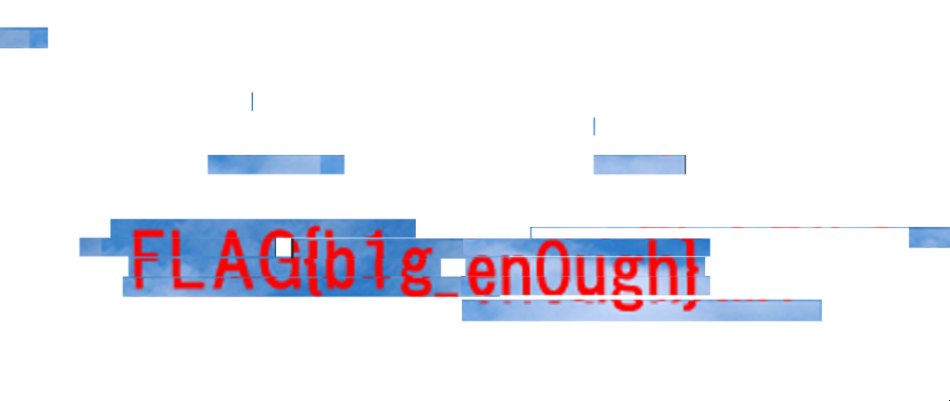

# tiny_10px
### 218pt Normal

What a small world!

# Solución

1. Inicialmente, utilicé varias herramientas comunes en análisis de esteganografía y metadatos, como ExifTool, Binwalk, y Steghide. Lamentablemente, estas herramientas no revelaron información útil directamente.

2. Dado que el enunciado del reto mencionaba la palabra "small", decidí investigar específicamente sobre las dimensiones de las imágenes JPEG. Encontré un blog muy informativo en [cyberhacktics](https://cyberhacktics.com/hiding-information-by-changing-an-images-height/) que detallaba cómo la información puede ocultarse alterando las dimensiones de la imagen en los datos hexadecimales.

  

3. Utilicé la herramienta en línea [Hexed](https://hexed.it/) para examinar los datos hexadecimales de la imagen. Este análisis me permitió identificar los valores que correspondían a las dimensiones de la imagen.

  

4. Con esta información obtenida, procedí a modificar los valores de tamaño en la cabecera de la imagen, eligiendo valores aleatorios que pensé podrían ayudarme a ver algo más.

5. Tras descargar y visualizar la imagen modificada, noté que aparecían algunas letras dispersas a lo largo de la imagen, lo cual indicaba una posible presencia de la bandera en un formato alterado.

  

6. Con la ayuda de un editor gráfico simple como Paint, pude reordenar y alinear las letras para formar una bandera.

  

### FLAG{b1g_en0ugh}
