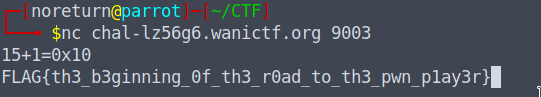

# nc
### 118pt Beginner

Pwn challenges often require connecting to the challenge server using the nc (netcat) command. It's important to learn how to use nc.

You can connect to the challenge server by executing the following command in your shell. Solve the problem at the connection point and obtain the flag.

`nc chal-lz56g6.wanictf.org 9003`

[Archivo](../files/pwn-nc.zip)

# Solución

1. Se realizá la conexión por medio de netcan y se realizó una prueba para revisar que información trae.
  
2. Se descargó el `.zip` y se validó el archivo llamado `main.c`, en este se identificó una parte que confirma la respuesta que se necesita para obtener la Flag.

3. ```
   int main(){
    init();
    int answer;
    printf("15+1=0x");
    scanf("%d", &answer);
    if(answer == 10){
        win();
    }
   ```
Donde se debe poner 10, para obtener la Flag.

<p align="center">
  
</p>

### FLAG{th3_b3ginning_0f_th3_r0ad_to_th3_pwn_p1ay3r}
