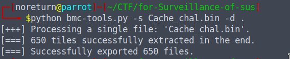
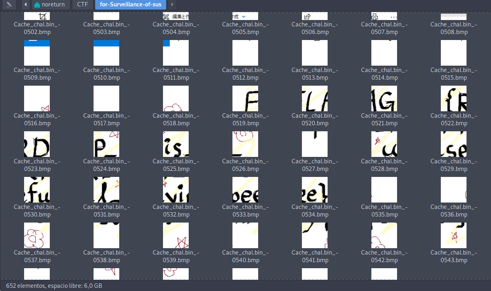
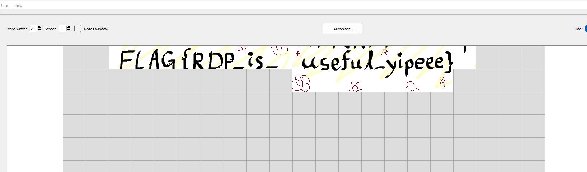

1. Confirmar que tipo de archiv es.
2. De acuerdo a la descripción, nos indica que es un archivo de cache de un PC el cual fue recuperado para investigar.
3. Con la experciencias anteriores de jugar CTF, recordé de un repositorio [Repositorio](https://github.com/ANSSI-FR/bmc-tools/blob/master/bmc-tools.py) el cual nos ayuda a analizar caché de bits RDP.
4. Usamos el codigo de python para intentarlo:

  Donde se utiliza los parámetros -s para indicar donde están el archivo .bin y el -d para indicar donde se desea tener la información que se va a obtener.

5. Luego de esperar unos minutos, obtenemos una gran cantidad de archivos tipo bmp, los cuales son imágenes o recortes de imágenes, al buscar un poco mas sobre esto, logramos tener la aplicación [RdpCacheStitcher](https://github.com/BSI-Bund/RdpCacheStitcher/blob/main/README.md) que nos sirve para unir estas imágenes, en un tipo de rompecabezas.

6. Encontramos la flag: FLAG{RDP_is_useful_yipeee}

