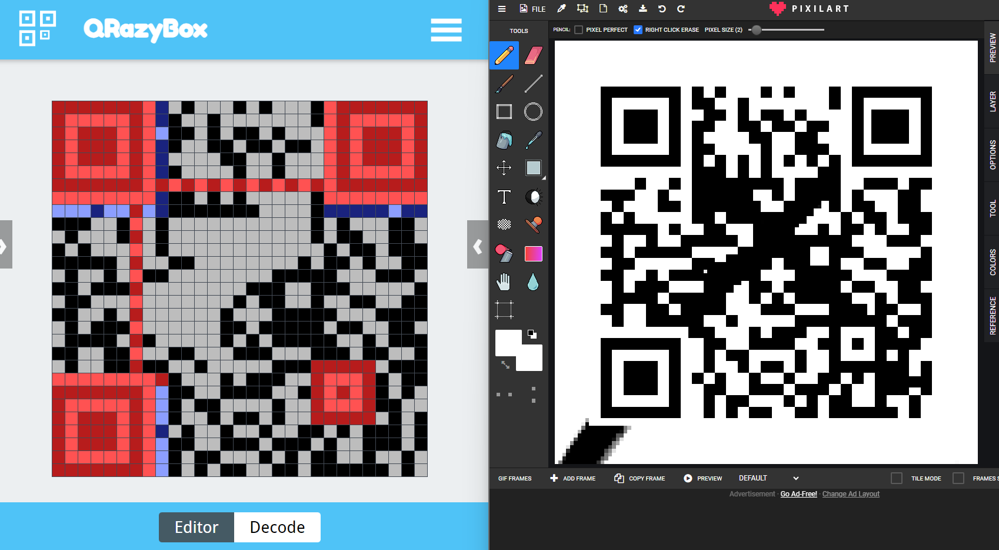
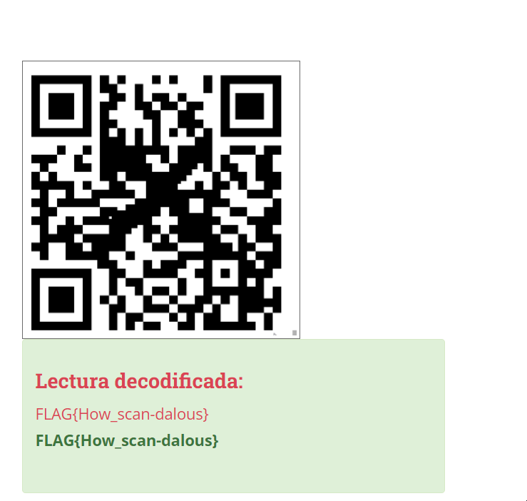

# codebreaker
### 192pt Beginner

### Content
I, the codebreaker, have broken the QR code!

## Solución

1. Leemos un poco de la estructura de estos codigos QR. [Link](https://medium.com/@r00__/decoding-a-broken-qr-code-39fc3473a034)
   
2. Nos ayudamos de [Merri.cx](https://merri.cx/qrazybox/) para revisar las esquizas del código QR y así mismo terminar de hacerlas. 
   

3. Luego de eliminar un poco la X del código y ajustar bien las esquinas, obtenemos un código mas completo, el cual puede ser leído sin problemas.

